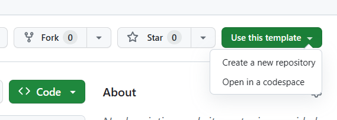
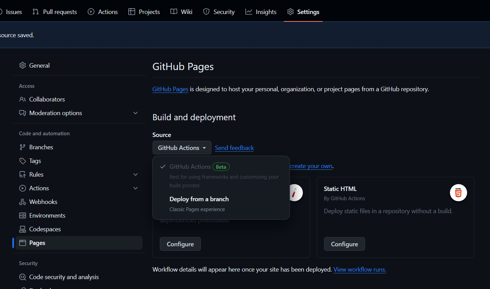

## Write Up
We wanted to provide a breakdown of how every country in the world produces their electricity from various energy sources. We created a world map using GeoJSON and colored coded it based on overall electricity production for a certain energy source (gas, coal, etc.) Also, when someone hovers over a country, it provides a graph of that country's electricity production.

For our development process, we started off by loading a general world map and then added in the OWID Energy data. From this, we looped through the various countries and added their country code into a dictionary; we tested this by printing the country code to the console as we added them. Afterwards, we added a dropdown option for the user to choose a certain energy type, which was saved to a local variable. Using this variable, we then updated the world map to have a gradient based on that country’s electricity production. We then added a dropdown menu to choose a certain year, to allow an even more immersive and specific view. Finally, we added a bar graph on hover.

The aspects that took the most time was how to connect the country codes to their specific data.

Charles Wang: Loaded GeoJSON map, connected energy type selection to column, added in gradient of colors
Jevan Chahal: Connected country electricity data to map, added tooltip for bar graph, year dropdown menu, Coloring in the legend
Abishek Siva: energy type selection dropdown, writeup


# create-svelte

## Generate static site using svelte SSG

To assist you in creating a static webpage for GitHub Pages using Svelte, we have developed a template for you: [ShaokangJiang/svelte-template (github.com)](https://github.com/ShaokangJiang/svelte-template).

Please follow the link provided, and initiate the creation of a new repository.



After GitHub completes the cloning process, navigate to the settings page. On the left panel, under the "Pages" tab, locate the "Source" section and select "GitHub Actions" as the source. 

Clone this repository and proceed with your work. Upon completion, commit and push your changes. The corresponding GitHub Actions will then execute, building a static website hosted at `https://your-username.github.io/your-repo-name` for you.



### Migrate from your project

If you have started on the project and want to switch to using this template, you can copy your `src` folder, go to the local clone of your version of this template, then paste it. When it says the file exists, simply click replace, and you can continue working on your version of this template.

## Setup

Once you've created a project and installed dependencies with `npm install` (or `pnpm install` or `yarn`), start a development server:

```bash
npm run dev

# or start the server and open the app in a new browser tab
npm run dev -- --open
```

## Building static site

Just push to github. 
